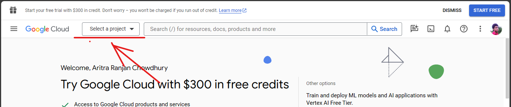
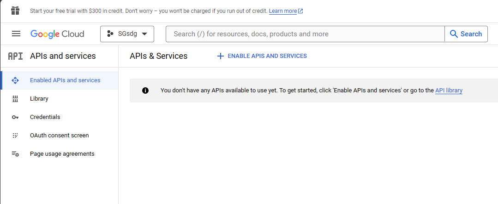
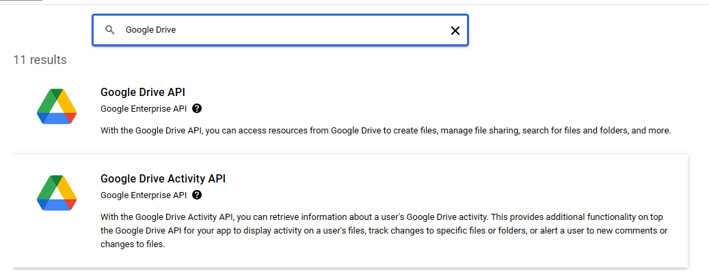
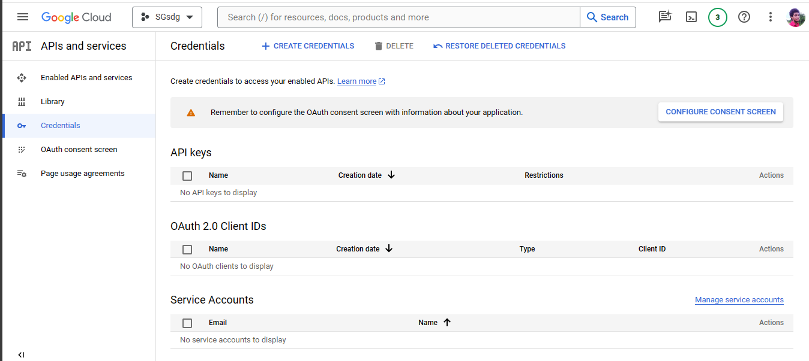
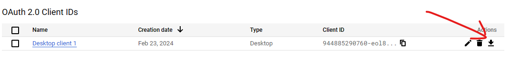
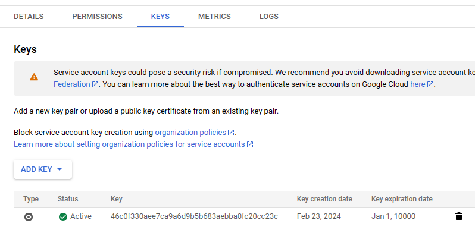

# **Title** : : Intelligent Document Finder with Llama Index 

## Project Information and Overview 

### Features : 
1. Automatic Retrieve data from Google Drive folders.
    - System Check in certain time interval if changes occurs on selected Google Drive if occurs then it decode that and read newly created or updated files from the Google Drive and **store** all the data in a vector database for future search 
    - As Vector Database ```ChromaDB``` has been used 
2. Retrieve any text based document files 
    - System is able to retrieve any kind of text information files Ex. Documents, PDF, PPD, HTML, Markdown etc.
    - Using ```llama_index.readers.google.GoogleDriveReader``` to load all document from the selected Google Drive folder 
3. Preprocessing and Vector Store Indexing :
    - Index all the retrieve data by making few pre process like Title Extraction , Paragraph Extraction, etc. 
4.  Google's Gemini Model as LLM to answer the Query 

### Process 
1. Create Google Drive Credential and Service Account 
2. Activate Google Drive API Service 
3. Implement Google Drive Monitoring System 
    - Requesting for activity Google Drive to fetch data during certain time intervals 
    - Checking Changes are available or not 
    - If available read files that are changed 
4. Process data to extract features 
5. Integrating ChromaDB with llama_index's VectorStoreIndex 
6. Integrate Gemini to retrieve data 
7. Implement a frontend with Gradio 

### Module Information 
- [constants.py]()
    - Contains all Global Constant elements 
    - Any modification can be done by change this file attribute 
- [document_processor.py]()
    - contains function that process a documents to convert small chunks Node with applying few metadata extractor.
    - contains a function that work on metadata and extract required metadata 
- [drive_utils.py]()
    - contains function that watch drive in certain time interval and using callbacks automatically process and index the documents. 
- [vector_store.py]()
    - Contains a class ChromaVectorStoreIndex that helps to indexing documents using ChromaDB 
- [main.py]()
    - Main Module runs in two different independent threads 
        1. Monitor Google drive to check if any changes happens or not. Update Vector Store Database id updated. 
        2. Run The Gradio interface along with run query search on Vector Store 

## How to **RUN**
### Step 1 : Active Google Drive API and Setup Google Credentials 
1. Goto to the [Google Cloud console](https://console.cloud.google.com/welcome/new?pli=1)

2. Select or Create a project 
3. Navigate to API and Services and click on Enable API and services 

4. Search for Google Drive and enable `Google Drive API` and 'Google Drive Activity API' and enable both 

5. Now Go back to API and Services pages as shown in 3 and Navigate to the **Credentials**

6. Create an API Key, OAuth Client , and Service Account. Download the OAuth Client 'Client_Secret.json'

7. Go to Service Account and create key and Download the key 

8. Place the key content and Client Secret on the example Google_Credentials folder 
### Step 2: Set API Key in .env file 
- follow this site to create easy API key https://aistudio.google.com/app/apikey

Please Modify the Constant Module for any changes before RUN
```bash
python -m venv .env 
## Run from the Git Bash Shell 
source ./env/Scripts/activate 
## Run from the Command Prompt Shell 
# ./env/Scripts/activate.bat
pip install -r requirements.txt
cd WebService
python main.py
```


## Limitations 
- 